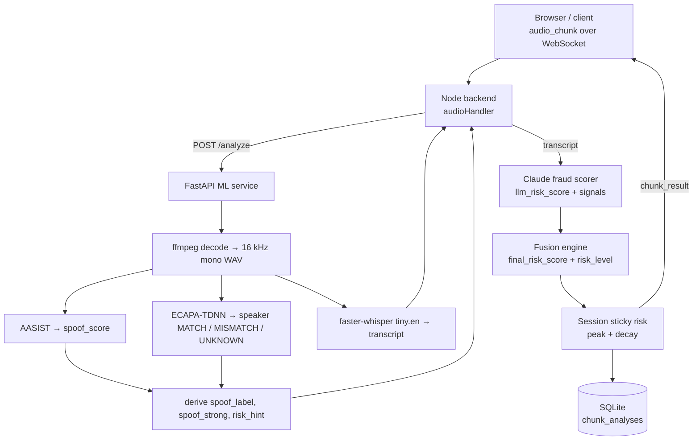
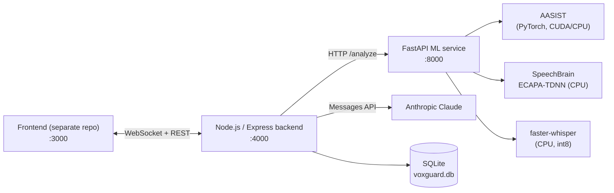

# VoxGuard

Real-time voice-clone and phone-scam detection that fuses acoustic anti-spoofing, speaker verification and LLM-based fraud-intent scoring.


---

## 📌 Overview

VoxGuard listens to a live call as a stream of short audio chunks. For each chunk it answers two questions:

1. **Is this voice who it claims to be?** It checks for synthetic or cloned speech (AASIST) and compares the voice with an enrolled speaker (SpeechBrain ECAPA-TDNN).
2. **Does what's being said look like a scam?** It transcribes the chunk locally with faster-whisper and has Claude score it for fraud signals such as OTP requests, urgency, impersonation, money requests, threats and secrecy.

A fusion engine combines both signals into a per-chunk **LOW / MEDIUM / HIGH** risk level. It also keeps a session-level "sticky" risk, so a single fraudulent sentence isn't hidden by the silence that follows it.

It's built for people receiving phone calls, especially users targeted by "bank official" and OTP scams, where the caller's voice may be cloned.

## 🎯 Problem Statement

Voice cloning is now cheap and convincing. A scammer can imitate a relative, a bank employee or an official, and the listener gets no reliable acoustic cue that the voice is fake. At the same time, existing anti-spoofing models are trained on older TTS systems and often fail on modern neural voices (see [Results & Limitations](#-results--honest-limitations)). Relying on a single detector is not safe.

## 💡 Solution

VoxGuard does not rely on one model. It layers three independent signals:

| Signal | Component | What it catches |
|---|---|---|
| Acoustic spoofing | AASIST (pretrained, ASVspoof 2019 LA) | Synthetic / vocoder artefacts |
| Speaker identity | SpeechBrain ECAPA-TDNN + cosine similarity | A voice that doesn't match the enrolled person |
| Conversational intent | faster-whisper transcript → Claude (`claude-haiku-4-5`) | Scam language, whatever the voice |

Because acoustic scores are unreliable on compressed browser audio (WebM/Opus), the pipeline is deliberately **content-driven**. Only fraud content detected by the LLM can raise the session risk. Acoustic signals shape the per-chunk score, but they never escalate a session on their own.

## ✨ Key Features

### ✅ Implemented

**Real-time pipeline (Node.js backend)**
- WebSocket server that accepts `audio_chunk` messages (base64 audio plus an optional client transcript) and streams back a `chunk_result` for each one
- A session is created automatically for each WebSocket connection and closed when the socket disconnects
- Calls the ML service with graceful degradation: if it fails (8 s timeout, connection refused, bad response), the backend returns a neutral fallback instead of crashing the session
- Claude-based fraud scorer with a model fallback chain, a 5 s timeout, tolerant JSON parsing and a safe `0` score on any failure
- Fusion engine driven by the ML service's `risk_hint` (LOW / HIGH / NEUTRAL)
- Session-level sticky risk: fraud content raises the session peak, and the peak drops one level after 5 consecutive clean or silent chunks
- Per-chunk latency tracking, with a per-session summary logged on disconnect
- Every chunk analysis is saved to SQLite
- REST endpoints for health, session history and session create/end

**ML service (Python / FastAPI)**
- `/analyze`: AASIST spoof score, speaker verification and a fast `tiny.en` Whisper transcript (greedy decoding with voice-activity detection), used by the live path
- `/analyze-full`: the same analysis with the larger `base` Whisper model and beam search, for more accurate transcripts
- `/enroll`: enrolls a single reference speaker; the embedding is saved to `data/enrolled_speaker.npy`
- Accepts any audio container ffmpeg can decode (WAV, MP3, OGG, WebM/Opus from `MediaRecorder`) using a bundled ffmpeg binary, so no system install is needed
- Calibrated signals: the raw `spoof_score` is kept for logging only, `spoof_strong` requires a score ≥ 0.98 **and** a speaker mismatch
- Models are loaded lazily and cached; every endpoint falls back to a fixed safe response shape instead of returning a 5xx

**Evaluation tooling**
- `ml/test_model.py`: AASIST smoke test on real samples or synthetic signals
- `generate_samples.py`, `test_accent.py`, `test_accent_control_us.py`: Indian-accent / Hinglish TTS evaluation with a US-English control
- `demo/test-websocket.js`: end-to-end WebSocket test covering 3 scripted scam scenarios

### 🟡 Partially implemented

- **Frontend.** The launcher (`start-voxguard.bat`) starts a frontend on `http://localhost:3000`, and the commit history mentions a phone-style UI, a status pill and an OTP hard-stop popup. But `frontend/` is a gitlink with **no `.gitmodules` entry**, so its source is not part of this repository.
- **Speaker enrollment from the backend.** `/enroll` exists on the ML service, but the Node backend has no route that proxies to it. Clients have to call the ML service directly.
- **`/analyze-full`** is implemented in the ML service, but the Node backend never calls it; the live WebSocket path only uses `/analyze`.
- **`POST /sessions`** creates a session row, but WebSocket connections always create their own session ID, so a session created over REST isn't linked to a stream.
- **Single-speaker enrollment.** Enrolling a new speaker overwrites the previous one. There is no per-user profile.
- **Logging.** The pino logger uses its default settings (`src/utils/logger.ts` has a TODO for configuring level, transport and redaction).

### 🗺️ Roadmap (not implemented)

These come from the project's own results notes and are **not** in the code yet:
- Fine-tune AASIST on newer or in-the-wild data (ASVspoof 2021/5, in-the-wild deepfakes, modern and Indian-accent TTS)
- Recalibrate the spoof threshold on that data and report detection rates per accent with confidence intervals
- Authentication, multi-user enrollment, Docker/CI and an automated test suite. None of these exist yet.

## 🧠 Detection Pipeline

Every audio chunk flows through the following steps:



### 1. The ML service derives the `risk_hint`

| Speaker status | `risk_hint` | Meaning |
|---|---|---|
| `MATCH` (similarity > 0.60) | `LOW` | Enrolled genuine speaker, so a high spoof score is ignored |
| `MISMATCH` | `HIGH` | Voice differs from the enrolled speaker (possible clone) |
| `UNKNOWN` (nobody enrolled) | `NEUTRAL` | Score on content, plus `spoof_strong` |

`spoof_strong = spoof_score ≥ 0.98 AND speaker_status == MISMATCH`

### 2. Fusion (`src/services/fusionEngine.ts`)

| `risk_hint` | `final_risk_score` |
|---|---|
| `LOW` | `llm` if `llm ≥ 0.6`, otherwise `llm × 0.4` |
| `HIGH` | `max(0.75, llm)` |
| `NEUTRAL` | `llm × 0.6 + (spoof_strong ? 0.4 : 0)` |

Risk level: **HIGH** ≥ 0.7 · **MEDIUM** ≥ 0.4 · **LOW** otherwise.

### 3. Session sticky risk (`src/ws/audioHandler.ts`)

- Only a chunk with a real transcript **and** at least one LLM-detected fraud signal can raise the session peak.
- A HIGH that comes only from acoustic signals, with no fraud content, is logged and ignored.
- After 5 consecutive clean or silent chunks, an elevated session drops one level (HIGH → MEDIUM → LOW).
- `session_signals` collects every fraud signal seen during the call.

## 🏗️ System Architecture



| Layer | Tech |
|---|---|
| Backend | Node.js, TypeScript, Express 4, `ws`, axios, pino, dotenv |
| LLM | `@anthropic-ai/sdk` (`claude-haiku-4-5`, with fallbacks) |
| Database | SQLite via `better-sqlite3` (WAL mode, foreign keys on) |
| ML service | Python 3.13, FastAPI, uvicorn, PyTorch 2.6, librosa, soundfile |
| Models | AASIST (clovaai), SpeechBrain `spkrec-ecapa-voxceleb`, faster-whisper `tiny.en` / `base` |
| Audio decode | `imageio-ffmpeg` (bundled ffmpeg) |

## 📁 Project Structure

```
.
├── src/                        # Node.js backend (TypeScript)
│   ├── index.ts                # Express + HTTP server + WebSocket bootstrap
│   ├── ws/audioHandler.ts      # Per-connection pipeline + sticky session risk
│   ├── services/
│   │   ├── mlBridge.ts         # Calls ML /analyze with safe fallback
│   │   ├── claudeScorer.ts     # Claude fraud-intent scorer
│   │   └── fusionEngine.ts     # ML + LLM → final risk
│   ├── routes/                 # /health, /sessions
│   ├── db/                     # SQLite schema + queries
│   ├── types/contracts.ts      # Shared response contracts
│   └── utils/                  # logger, latency tracker
├── main.py                     # FastAPI ML service (/analyze, /analyze-full, /enroll)
├── speaker_verify.py           # SpeechBrain enrollment / verification
├── transcribe.py               # faster-whisper transcription
├── ml/
│   ├── model.py                # analyze_audio() — AASIST inference
│   ├── test_model.py           # AASIST smoke test
│   ├── aasist/                 # Vendored clovaai/aasist scripts (see setup)
│   ├── real_samples/           # 3 genuine + 3 TTS evaluation clips
│   └── results.md              # AASIST evaluation results
├── samples/                    # Indian-accent + US control TTS clips
├── generate_samples.py         # edge-tts sample generator
├── test_accent.py              # Indian-accent evaluation
├── test_accent_control_us.py   # US-English control evaluation
├── results_indian_accent.md    # Accent evaluation write-up
├── demo/                       # WebSocket demo script + notes
├── frontend                    # Gitlink only — source not included
└── start-voxguard.bat          # Windows launcher for all 3 services
```

## 🚀 Getting Started

### Prerequisites

- Node.js 20+ and npm
- Python 3.13 (the version the project was developed and tested with)
- Optional: an NVIDIA GPU with CUDA for AASIST (it falls back to CPU otherwise)
- An Anthropic API key for content scoring

### 1. Backend

```bash
npm install
cp .env.example .env        # then set ANTHROPIC_API_KEY
npm run dev                 # tsx watch → http://localhost:4000
```

### 2. ML service

```bash
cd ml
python -m venv .venv
.venv\Scripts\activate                     # Windows  (source .venv/bin/activate on macOS/Linux)
pip install torch torchaudio --index-url https://download.pytorch.org/whl/cu124   # or /whl/cpu
pip install -r requirements.txt
cd ..
pip install -r requirements.txt
```

> **AASIST model files are not in this repository.** `ml/model.py` expects
> `ml/aasist/config/AASIST.conf`, `ml/aasist/models/AASIST.py` and
> `ml/aasist/models/weights/AASIST.pth`. Copy the `config/` and `models/`
> folders from [clovaai/aasist](https://github.com/clovaai/aasist) into `ml/aasist/`.
> Without them, `analyze_audio()` returns its fallback score of `0.5` for every clip.

Start the service from the repository root:

```bash
uvicorn main:app --reload --port 8000
```

SpeechBrain and faster-whisper download their pretrained weights from Hugging Face on first use.

### 3. Frontend

The frontend source is not included in this repository (see [Partially implemented](#-partially-implemented)). `start-voxguard.bat` expects it in `frontend/`, started with `npm run dev` on port 3000.

### Windows launcher

`start-voxguard.bat` opens all three services in separate windows. It uses the **hardcoded path `C:\VoxGuard`**, so edit it if your clone is somewhere else.

### Try it without a frontend

```bash
node demo/test-websocket.js
```

This sends three scripted transcripts (one benign, two scam scenarios) with dummy audio and prints each `chunk_result`. See [`demo/README.md`](demo/README.md) for the expected results.

## ⚙️ Environment Variables

**Node backend (`.env`)**

| Variable | Default | Description |
|---|---|---|
| `PORT` | `4000` | HTTP + WebSocket port |
| `ML_API_URL` | `http://localhost:8000` | ML service base URL |
| `ANTHROPIC_API_KEY` | — | Required for Claude fraud scoring |
| `DB_PATH` | `./voxguard.db` | SQLite database file |

**ML service (optional)**

| Variable | Default | Description |
|---|---|---|
| `SPEAKER_DEVICE` | `cpu` | Device for ECAPA-TDNN |
| `WHISPER_DEVICE` | `cpu` | Device for faster-whisper |
| `WHISPER_COMPUTE_TYPE` | `int8` | faster-whisper compute type |
| `WHISPER_MODEL_SIZE_LIVE` | `tiny.en` | Default model size in `transcribe.py` |
| `WHISPER_MODEL_SIZE` | `base` | Full-path model size in `transcribe.py` |

> `main.py` passes explicit sizes (`tiny.en` for `/analyze`, `base` for `/analyze-full`), so the two `WHISPER_MODEL_SIZE*` variables only affect direct calls to `transcribe()`.

## 🔌 API Reference

### Node backend (`:4000`)

| Method | Path | Description |
|---|---|---|
| `GET` | `/health` | `{ status, timestamp, uptime }` |
| `POST` | `/sessions` | Creates a session → `{ session_id, created_at, status }` |
| `GET` | `/sessions/history?limit=20` | Recent sessions joined with their chunk analyses (limit 1–100) |
| `DELETE` | `/sessions/:sessionId` | Marks a session as ended |

**WebSocket** (`ws://localhost:4000`)

```jsonc
// server → client, on connect
{ "type": "session_started", "session_id": "…" }

// client → server
{ "type": "audio_chunk", "audio_base64": "<base64 audio>", "transcript": "optional fallback text" }

// server → client, per chunk
{
  "type": "chunk_result",
  "session_id": "…", "chunk_id": 1,
  "ml":     { "speaker_similarity", "speaker_status", "spoof_score", "spoof_label",
              "spoof_strong", "risk_hint", "transcript" },
  "llm":    { "llm_risk_score", "detected_signals": [] },
  "fusion": { "final_risk_score", "risk_level", "reason" },
  "latency_ms": 0, "timestamp": "…",
  "session_risk_score": 0, "session_risk_level": "LOW",
  "session_reason": "…", "session_signals": []
}
```

The ML service's Whisper transcript is preferred for scoring. The client-supplied `transcript` is used only when the ML service returns an empty transcript.

### ML service (`:8000`)

| Method | Path | Body | Returns |
|---|---|---|---|
| `GET` | `/health` | — | `{ status: "ok" }` |
| `POST` | `/analyze` | `{ audio_base64 }` | ML analysis (live, `tiny.en`) |
| `POST` | `/analyze-full` | `{ audio_base64 }` | ML analysis (`base` + beam search) |
| `POST` | `/enroll` | `{ audio_base64 }` | `{ enrolled: bool }` |

## 🗄️ Data Model

Created automatically by `src/db/init.ts`:

- **`sessions`**: `id`, `created_at`, `ended_at`, `status`
- **`chunk_analyses`**: `session_id` (FK), `chunk_id`, `spoof_score`, `speaker_similarity`, `speaker_status`, `spoof_label`, `transcript`, `llm_risk_score`, `detected_signals` (JSON), `final_risk_score`, `risk_level`, `reason`, `latency_ms`, `timestamp`

Session-level sticky risk is streamed to the client but is **not** saved to the database.

## 📊 Results & Honest Limitations

The anti-spoofing model is a **pretrained AASIST checkpoint used as-is**, with no fine-tuning. Full details are in [`ml/results.md`](ml/results.md) and [`results_indian_accent.md`](results_indian_accent.md).

| Test set | Result |
|---|---|
| 3 genuine + 3 Piper TTS clips | 4 / 6 correct at a 0.5 threshold |
| 5 Indian-accent / Hinglish edge-tts clips | 3 / 5 flagged as spoof (60 %) |
| Same 5 sentences, US-English edge-tts voices | 1 / 5 flagged as spoof (20 %) |
| Warm AASIST inference (RTX 3050) | ~470 ms per 4 s chunk |

What these results show:
- The misses come from a **generalisation gap to modern neural TTS**, not from accent bias.
- When AASIST is wrong, it is often confidently wrong. Scores cluster near 0 or 1.
- On compressed browser audio, the raw spoof score saturates near 1.0 even for genuine speech. That's why fusion ignores the raw score and the session risk is driven by content.
- The sample sizes are very small (n = 5–6 per set), so treat these numbers as directional.

## ⚠️ Known Issues

- `npm start` runs `node dist/index.ts`; after `npm run build` it should point to `dist/index.js`.
- `start-voxguard.bat` and `test_accent*.py` hardcode `C:\VoxGuard` paths.
- SQLite WAL files (`voxguard.db-wal`, `voxguard.db-shm`) are committed, even though `*.db` is gitignored.
- There's no automated test suite, CI, Docker setup or authentication.

## 🙏 Acknowledgements

- [AASIST](https://github.com/clovaai/aasist) by NAVER Corp. (MIT; see `ml/aasist/LICENSE` and `ml/aasist/NOTICE`)
- [SpeechBrain](https://speechbrain.github.io/) ECAPA-TDNN speaker embeddings
- [faster-whisper](https://github.com/SYSTRAN/faster-whisper)
- [Anthropic Claude](https://www.anthropic.com/)
- Evaluation audio: LibriSpeech, VOiCES, Piper samples and Microsoft edge-tts voices (provenance in `ml/results.md`)

## 📄 License

No license file has been added to this repository yet. The vendored AASIST code in `ml/aasist/` is under its own MIT license.
